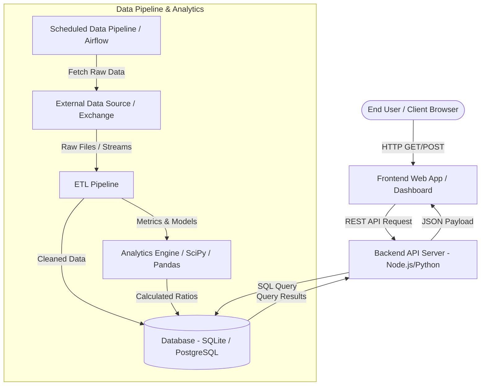

# Software Architecture & Data Flow Documentation

> **Bluestock Fintech Internship — Week 2 Prerequisite**  
> **Author:** Akash Kumar Pandit

---

## 1. System Data Flow Architecture

---

## 2. Component Descriptions

1. **Frontend Layer:** React / Dash interactive web application providing charts, dashboards, and slicers.
2. **Backend API Layer:** Express / FastAPI server routing client authentication, business logic, and API calls.
3. **Database Layer:** SQLite / PostgreSQL relational database storing user profiles, transaction logs, company fundamentals, and calculated metrics.
4. **ETL Data Pipeline:** Scheduled Python background scripts processing raw data feeds, verifying data quality rules, and populating analytical schemas.
5. **Analytics & Ratio Engine:** Quantitative algorithms computing Alpha, Beta, Volatility, Moving Averages, and Financial Ratios.
